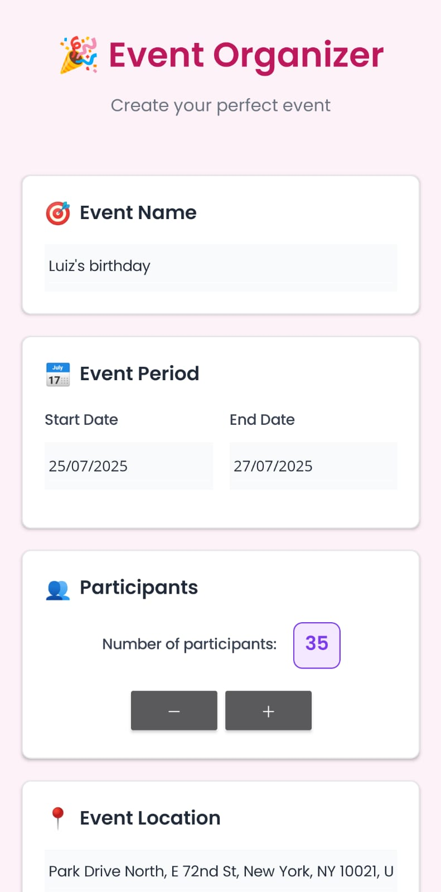
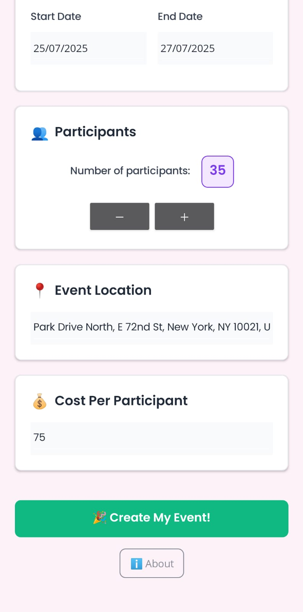
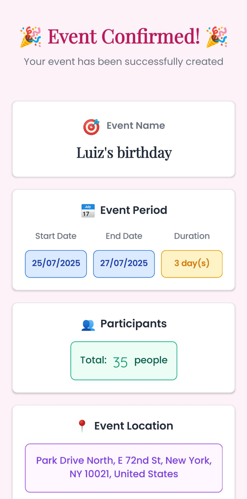
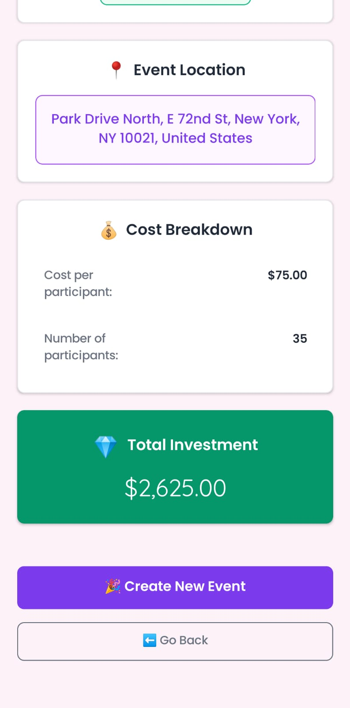
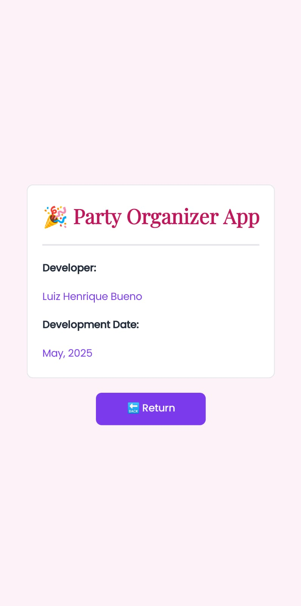

# Party Organizer App

  
  
  

A cross-platform mobile application for comprehensive event planning and management, built with .NET MAUI.

## Overview

The Party Organizer App provides a complete solution for event planning, featuring intuitive interfaces for event creation, participant management, and cost tracking. The application supports various event types and scales from intimate gatherings to large celebrations.

## Key Features

- **Event Management**: Comprehensive event creation with detailed information handling
- **Date Management**: Advanced date selection with validation and constraints
- **Participant Tracking**: Dynamic management of event attendees
- **Cost Calculation**: Automated pricing calculations with real-time updates
- **Location Management**: Integrated venue coordination system
- **Event Confirmation**: Professional summary and confirmation workflows

## Screenshots

### Event Creation

### Event Confirmation

### Application Information

## Technical Stack

- **Framework**: .NET MAUI (Multi-platform App UI)
- **Language**: C#
- **UI Technology**: XAML with data binding
- **Architecture**: MVVM pattern
- **Platforms**: iOS, Android, Windows, macOS
